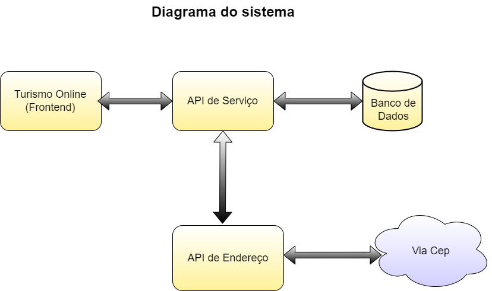

# Projeto MVP Micriserviço

Este pequeno projeto é o MVP da disciplina **Arquitetura de Software** 

O objetivo é criar uma pequena POC (`Proof of consept`) de um sistema de e-commerce com o conteúdo apresentado nas disciplinas.

# Frontend

Este sistema foi criado para ser um SPA (`Single Page Application`) e destina-se a ser a interface com o usuário.
Está e´a camada de apresentação do sistema que foi feita em html css e java script

## Diagrama da Aplicação


---
## Apis consumidas


---
## Como executar através do Docker

# Projeto NGINX com Docker

Este projeto utiliza o Docker para criar um servidor NGINX que serve uma página HTML estática.

## Pré-requisitos

- Docker instalado em seu sistema.

## Instruções

1. **Construir a imagem Docker**

    No diretório do projeto, onde o Dockerfile está localizado, execute o seguinte comando para construir a imagem Docker:

    ```
    docker build -t turismo_online_front .
    ```

    Este comando cria uma imagem Docker chamada `turismo_online_front` a partir do Dockerfile.

2. **Executar o contêiner Docker**

    Após a construção da imagem, você pode executar o contêiner usando o seguinte comando:

    ```
    docker run -p 8080:80 turismo_online_front
    ```

    Este comando inicia um contêiner a partir da imagem `turismo_online_front` e mapeia a porta 8080 do seu sistema para a porta 80 do contêiner.

3. **Acessar a página HTML**

    Agora, você deve ser capaz de acessar sua página HTML estática em `http://localhost:8080` no seu navegador.

    > Para ter acesso as funcionalidades, é necessário que os outros serviçoes esteja em execução.